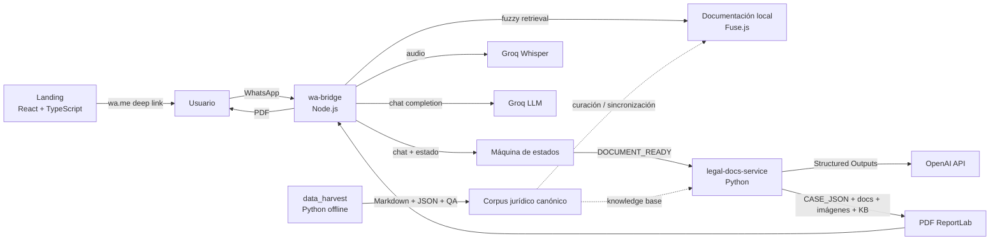
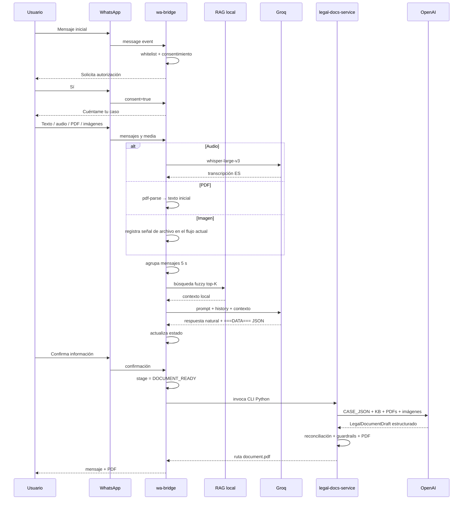
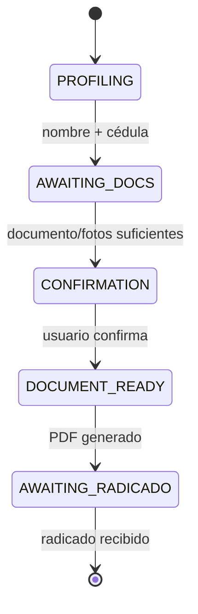

<p align="center">
  
</p>

<h1 align="center">Jovita — Disaster Legal Assistant</h1>

<p align="center">
  <strong>Asistencia legal conversacional por WhatsApp para personas cuyo inmueble fue afectado por un desastre.</strong><br/>
  Colombia Tech Week 2026 · Hackathon MVP
</p>

---

## 1. ¿Qué es Jovita?

Jovita es un asistente legal conversacional diseñado para acompañar a personas que sufrieron daños en su vivienda después de un desastre —en el demo actual, el terremoto ocurrido en Cali el 10 de agosto de 2026— y convertir una conversación cotidiana en un siguiente paso jurídico accionable.

La experiencia está pensada para que el usuario **no tenga que conocer derecho, llenar formularios complejos ni saber de antemano qué tipo de trámite necesita**. Puede contar lo ocurrido por texto o nota de voz, enviar contratos, pólizas y evidencia, y Jovita organiza progresivamente el caso.

El MVP integra cuatro capacidades técnicas principales:

1. **Interfaz conversacional por WhatsApp**, con consentimiento de tratamiento de datos y máquina de estados.
2. **Comprensión multimodal básica**, incluyendo transcripción de audio y lectura de PDFs.
3. **Recuperación de conocimiento jurídico**, mediante una base documental local para orientar la conversación.
4. **Generación estructurada de documentos legales en PDF**, con schemas, validaciones, evidencia fotográfica y guardrails jurídicos.

El repositorio también contiene una **landing de demo** y un **pipeline separado de ingestión documental** para convertir fuentes jurídicas a Markdown/JSON canónico y prepararlas para recuperación posterior.

> **Alcance del hackathon.** Jovita es un MVP tecnológico y no sustituye asesoría jurídica, técnica o profesional. El objetivo del prototipo es demostrar cómo una arquitectura conversacional, multimodal y document-centered puede reducir fricción para acceder a rutas jurídicas después de un desastre.

## Índice

- [1. ¿Qué es Jovita?](#1-qué-es-jovita)
- [2. Prueba rápida para jurados](#2-prueba-rápida-para-jurados)
- [3. Arquitectura general](#3-arquitectura-general)
- [4. Flujo end-to-end](#4-flujo-end-to-end)
- [5. Lenguajes y stack técnico](#5-lenguajes-y-stack-técnico)
- [6. Estructura del repositorio](#6-estructura-del-repositorio)
- [7. Landing](#7-landing--capa-de-presentación)
- [8. WhatsApp bridge](#8-wa-bridge--núcleo-conversacional)
- [9. Generación jurídica](#9-legal-docs-service--generación-jurídica-estructurada)
- [10. Pipeline de conocimiento](#10-data_harvest--pipeline-de-conocimiento-jurídico)
- [11. Simetría entre componentes](#11-simetría-entre-los-componentes)
- [12. Contratos de datos](#12-contratos-de-datos)
- [13. Instalación local](#13-instalación-local)
- [14. Docker Compose](#14-docker-compose)
- [15. Testing](#15-testing)
- [16. Seguridad y privacidad](#16-seguridad-privacidad-y-manejo-de-secretos)
- [18. Estado actual de integración](#18-estado-actual-de-integración)
- [22. Roadmap](#22-roadmap-técnico-posterior-al-hackathon)

---

## 2. Prueba rápida para jurados

No queremos que el jurado tenga que inventarse un caso. El repositorio está preparado para documentar dos recorridos reproducibles de extremo a extremo: uno de **arrendamiento** y otro de **propietario con póliza asociada al inmueble**.

La propuesta es añadir los assets públicos de prueba en una carpeta raíz `demo/` separada de los fixtures internos usados por tests:

```text
demo/
├── README.md
├── case-01-arrendatario/
│   ├── contrato_arrendamiento_rafael_angulo.pdf
│   └── evidence/
│       ├── interior1.jpeg
│       ├── interior2.jpeg
│       └── ...
└── case-02-propietario/
    ├── poliza_hogar_juan_jose_rojas_constain.pdf
    └── evidence/
        ├── interior1.jpeg
        ├── interior2.jpeg
        └── ...
```

> **Nota:** esta carpeta `demo/` es la ubicación recomendada para los assets de evaluación. En el snapshot analizado todavía no existe; el repositorio sí incluye fixtures técnicos equivalentes dentro de `legal-docs-service/fixtures/`.

### Caso 1 — Arrendatario · salida de producto: solicitud frente a la cancelación/terminación del contrato

**Objetivo funcional:** llevar al usuario desde un relato libre hasta una solicitud accionable dirigida al arrendador/inmobiliaria frente a la afectación del inmueble y la continuidad o terminación del contrato.

**Implementación jurídica del snapshot:** el generador produce `rental_damage_notice`, una comunicación de afectación con solicitudes contractuales. Esto permite sustentar la petición frente al contrato sin declarar por sí mismo una terminación automática ni certificar inhabitabilidad sin soporte técnico.

#### Turno 1 — iniciar el flujo

Enviar:

```text
Hola, se dañó mi inmueble por un desastre. ¿Cómo me puedes ayudar?
```

Jovita presenta el consentimiento de tratamiento de datos.

#### Turno 2 — consentimiento

Enviar:

```text
Sí
```

#### Turno 3 — contar el caso en lenguaje natural

Enviar por texto o nota de voz:

```text
Hola Jovita, soy Rafael Angulo y estaba viviendo arrendando en una casa en el Ingenio en Cali, y a raíz del terremoto del 10 de agosto, la casa quedó inhabitable y no sé qué hacer ahora. Mi cédula es 1020768904. La dirección es calle 28C, 68-45. Creo que guardé en una carpeta mi contrato de arriendamiento, lo puedo buscar y pues tengo fotos de como todo quedo vuelto m. Extrae cédula, nombre y dirección.
```

Datos que el flujo debe poder recuperar del relato:

```text
Nombre: Rafael Angulo
Cédula: 1020768904
Dirección: Calle 28C # 68-45, El Ingenio, Cali
Relación con el inmueble: arrendatario
Evento: terremoto
Fecha reportada: 10 de agosto de 2026
```

#### Turno 4 — adjuntar contrato

Adjuntar:

```text
demo/case-01-arrendatario/contrato_arrendamiento_rafael_angulo.pdf
```

#### Turno 5 — adjuntar evidencia

Adjuntar entre 1 y 6 fotografías del inmueble dañado, por ejemplo:

```text
demo/case-01-arrendatario/evidence/interior1.jpeg
demo/case-01-arrendatario/evidence/interior2.jpeg
```

El bridge agrupa mensajes consecutivos durante una ventana de 5 segundos para evitar responder una vez por cada archivo enviado en ráfaga.

#### Turno 6 — confirmar

Enviar:

```text
Sí, esa es la información, gracias por ayudarme.
```

#### Resultado esperado

El flujo llega al estado `DOCUMENT_READY` y prepara una comunicación PDF para el arrendador/inmobiliaria. En el generador jurídico actual el documento:

- identifica al remitente y al destinatario;
- describe el inmueble, el evento y las afectaciones;
- referencia contrato y evidencia usando IDs trazables;
- aplica razonamiento jurídico por subsunción cuando corresponde;
- solicita evaluación, reparación/habilitación, respuesta escrita y definición del tratamiento contractual del canon;
- incluye datos de notificación disponibles;
- incorpora un anexo fotográfico;
- evita afirmar terminación automática del contrato o inhabitabilidad sin soporte técnico.

### Caso 2 — Propietario con hipoteca y póliza

Este caso prueba una situación importante: **la percepción inicial del usuario puede ser incompleta**. Juan José dice que, hasta donde sabe, no compró un seguro, pero tiene un crédito hipotecario. Después aporta una póliza, que permite reencauzar el caso hacia la ruta de seguros.

#### Turnos 1 y 2

Usar el mismo inicio y consentimiento del Caso 1.

#### Turno 3 — contar el caso

Enviar por texto o nota de voz:

```text
Hola, Jovita, soy Juan José Rojas, mi cédula es 1-113-6-82-988. Yo soy el propietario de un inmueble que quedó destruido en el terremoto del 10 de agosto del 2026 en Cali. Mi inmueble queda en el edificio Villas de Guadalupe, en la carrera 56, número 14-57. y pues, se cayó el cielo raso, se dañaron paredes, un montón de cosas se dañaron. Yo, que yo sepa, yo no he comprado seguro, pero tengo la hipoteca, entonces, pues todavía estoy pagando el inmueble. No sé qué tenga que hacer, cómo me puedas ayudar.
```

#### Turno 4 — adjuntar póliza

Adjuntar:

```text
demo/case-02-propietario/poliza_hogar_juan_jose_rojas_constain.pdf
```

#### Turno 5 — adjuntar fotografías

Adjuntar entre 1 y 6 fotografías de los daños.

#### Turno 6 — confirmar

Enviar:

```text
Sí, esa es la información, gracias por ayudarme.
```

#### Resultado esperado

El caso se encamina a la ruta de seguros y genera un `insurance_loss_notice`.

Es importante la distinción jurídica: el servicio actual genera un **aviso inicial descriptivo de siniestro**, no una reclamación completa ni una exigencia de indemnización. El documento:

- identifica a la persona y la póliza disponible;
- describe el inmueble y el evento;
- enumera afectaciones reportadas/observables;
- incorpora fotos como evidencia;
- pide recepción, número de siniestro/referencia e instrucciones de seguimiento;
- no cuantifica pérdidas en esta primera etapa;
- no afirma cobertura ni obligación de indemnizar antes del proceso correspondiente.

---

## 3. Arquitectura general

Jovita está organizado como un repositorio **políglota y modular**. No existe un único servidor que haga todo; cada componente tiene una responsabilidad distinta.



### Dos planos diferentes: runtime y preparación documental

La arquitectura separa deliberadamente dos problemas:

**Runtime conversacional**

```text
landing → WhatsApp → wa-bridge → LLM/RAG → estado del caso → legal-docs-service → PDF
```

**Preparación offline de conocimiento jurídico**

```text
PDF/HTML/etc. → data_harvest → Structured JSON → QA → Markdown canónico → corpus jurídico
```

Esta separación evita que la ingestión pesada de documentos ocurra durante una conversación con un usuario.

---

## 4. Flujo end-to-end



> **Estado real del wiring en este snapshot:** el último tramo existe como integración de demo. `wa-bridge` dispara `legal-docs-service/main.py --demo rental|insurance`, por lo que el PDF generado actualmente proviene de fixtures internos según la ruta detectada. El adaptador que convierta automáticamente la conversación y los archivos reales de WhatsApp en un `CASE_JSON` persistido para el generador es la principal frontera pendiente para cerrar un pipeline totalmente dinámico.

---

## 5. Lenguajes y stack técnico

### Lenguajes de programación

| Capa | Lenguaje | Uso principal |
|---|---|---|
| WhatsApp bridge | JavaScript, CommonJS | eventos de WhatsApp, estado, RAG, LLM orchestration |
| Landing | TypeScript + TSX | interfaz React, navegación, CTA a WhatsApp |
| Generador jurídico | Python | schemas, LLM structured output, validación, render PDF |
| Ingestión jurídica | Python | conversión de documentos, QA, estado incremental |
| Estilos | CSS | diseño de landing |
| Infraestructura | Docker / Compose YAML | ejecución local de landing y bridge |
| Datos/configuración | JSON, Markdown, YAML | estado, fixtures, prompts, knowledge base, metadata |

El entorno de desarrollo incluido fue creado con **Python 3.12.6**. Los Dockerfiles de los servicios Node parten de **Node 20**.

### Lenguaje natural interno

El producto es deliberadamente **Spanish-first**:

- los prompts conversacionales y jurídicos están escritos en español;
- la salida de usuario está diseñada para español colombiano;
- los schemas y claves internas usan nombres técnicos estables —principalmente en inglés— para mantener contratos de datos legibles por código;
- la knowledge base contiene fuentes jurídicas colombianas procesadas en español.

Esta separación permite cambiar la redacción de usuario sin romper los contratos internos del sistema.

### Principales librerías

**`wa-bridge`**

- `whatsapp-web.js`: cliente de WhatsApp Web.
- `express`: endpoint local de autenticación/estado.
- `groq-sdk`: chat y transcripción.
- `pdf-parse`: extracción de texto de PDFs recibidos.
- `fuse.js`: búsqueda difusa sobre conocimiento local.
- `qrcode`: visualización del QR de autenticación.

**`landing`**

- React 19.
- TypeScript.
- Vite.
- Motion.
- Lucide React.
- Tailwind/Vite dependency disponible, aunque el diseño principal del snapshot está implementado en CSS propio.

**`legal-docs-service`**

- OpenAI SDK.
- Pydantic v2.
- ReportLab.
- pypdf.
- Pillow.
- pytest.

**`data_harvest/disaster-legal-doc-converter-v2`**

- OpenAI SDK.
- Pydantic.
- PyYAML.
- jsonschema.
- PyMuPDF.

---

## 6. Estructura del repositorio

Vista conceptual del snapshot:

```text
.
├── docker-compose.yml
├── landing/
├── wa-bridge/
├── legal-docs-service/
├── data_harvest/
│   └── disaster-legal-doc-converter-v2/
├── jovita-bot-service/
└── untitled.zip
```

### Responsabilidad de cada carpeta

| Carpeta | Responsabilidad | Runtime principal |
|---|---|---|
| `landing/` | presentación pública y entrada al demo | navegador |
| `wa-bridge/` | interfaz WhatsApp y orquestación conversacional | Node.js |
| `legal-docs-service/` | generación validada de documentos jurídicos | Python |
| `data_harvest/` | ingestión/normalización de fuentes jurídicas | Python offline |
| `jovita-bot-service/` | snapshot experimental de otro servicio Python | no forma parte de la ruta reproducible actual |
| `untitled.zip` | copia empaquetada de una versión de la landing | no runtime |

---

# 7. `landing/` — capa de presentación

```text
landing/
├── Dockerfile
├── package.json
├── vite.config.ts
├── public/
│   ├── logo.jpeg
│   └── ...
└── src/
    ├── App.tsx
    ├── config.ts
    ├── index.css
    ├── main.tsx
    ├── components/
    │   ├── DemoHero.tsx
    │   └── NavBar.tsx
    └── pages/
        ├── Landing.tsx
        ├── Team.tsx
        └── DataPolicy.tsx
```

### `src/config.ts`

Centraliza constantes públicas del demo:

- número de WhatsApp;
- mensaje prellenado;
- ID del video de YouTube;
- URL pública del repositorio.

`getWhatsAppUrl()` produce un deep link `wa.me` con el mensaje inicial codificado.

### `src/components/DemoHero.tsx`

Implementa el hero centrado en video:

- usa YouTube IFrame API;
- intenta autoplay;
- detecta finalización;
- al terminar superpone CTA para abrir WhatsApp;
- permite reproducir nuevamente el demo.

### `src/App.tsx`

Resuelve navegación ligera basada en hash:

```text
#equipo   → Team
#politica → DataPolicy
#demo     → ancla dentro de Landing
```

No usa un router externo: para el alcance del MVP, el hash funciona como mecanismo simple y suficiente.

### `DataPolicy.tsx`

Contiene el disclosure del MVP sobre:

- tratamiento de datos;
- documentos enviados;
- evidencia multimedia;
- derechos de habeas data;
- límites de responsabilidad.

La página indica explícitamente que el mecanismo de borrado descrito es un **mock-up**; el bridge actual no implementa todavía un handler de purga de datos por comando.

---

# 8. `wa-bridge/` — núcleo conversacional

`wa-bridge` es el punto central del runtime interactivo. Es un servicio Node.js que conecta WhatsApp Web con el flujo de conversación, el proveedor de LLM, la recuperación de conocimiento y la generación final de documentos.

```text
wa-bridge/
├── Dockerfile
├── package.json
├── test-groq.js
├── test-hardcode.js
├── test-ollama.js
└── src/
    ├── index.js
    ├── app.js
    ├── globals/
    │   └── whatsapp.js
    ├── features/
    │   ├── auth/
    │   │   ├── auth.controller.js
    │   │   ├── auth.routes.js
    │   │   └── views/index.html
    │   └── chatbot/
    │       ├── chatbot.controller.js
    │       ├── db.service.js
    │       └── flows/
    │           ├── welcome.flow.js
    │           └── profiling.flow.js
    ├── services/
    │   ├── llm.service.js
    │   ├── rag.service.js
    │   └── providers/
    │       └── groq.provider.js
    └── Documentacion/
        ├── faqs_legales.txt
        └── *.pdf
```

## 8.1 `src/index.js` — orquestador de entrada

Responsabilidades:

1. carga `.env`;
2. inicia Express;
3. inicializa el RAG;
4. escucha `client.on('message')` de WhatsApp;
5. ignora estados y valida whitelist;
6. procesa media;
7. agrupa mensajes consecutivos;
8. delega al chatbot controller;
9. responde texto y, si existe, PDF.

### Whitelist

Solo se procesan IDs incluidos en:

```env
WHITELIST=57300...@c.us,57301...@c.us
```

Esto es útil para un hackathon porque reduce exposición accidental del bot mientras se prueba con un conjunto controlado de números.

## 8.2 Agrupación de mensajes

El bridge mantiene una cola en memoria por usuario:

```js
global.messageQueues[userId] = {
  messages: [],
  timer: null,
  lastMsg: null
}
```

Cada mensaje reinicia un timer de **5 segundos**. Al vencer:

```text
mensajes consecutivos → join("\n") → una sola llamada al chatbot
```

Esto corrige un problema típico de WhatsApp: si el usuario envía tres fotos seguidas, el bot no debería contestar tres veces de manera independiente.

## 8.3 Procesamiento de media

### Audio

```text
WhatsApp media → base64 → archivo temporal → Groq Whisper → texto
```

Modelo configurado:

```text
whisper-large-v3
```

Idioma:

```text
es
```

La transcripción se incorpora al turno como:

```text
[Nota de voz transcrita]: ...
```

### PDF

```text
WhatsApp PDF → Buffer → pdf-parse → texto
```

El snapshot recorta a los primeros 4.000 caracteres para controlar contexto/tokens en el flujo conversacional.

### Imágenes

El runtime actual detecta que existe un archivo y lo representa en la cola como señal de adjunto cuando no hay caption. **Todavía no persiste la imagen ni la envía visualmente al LLM conversacional**. La ingestión visual completa sí existe en el generador Python cuando las imágenes ya están referenciadas en `CASE_JSON`.

## 8.4 `globals/whatsapp.js`

Encapsula `whatsapp-web.js` con `LocalAuth`.

Estados expuestos:

```text
INITIALIZING
AWAITING_SCAN
AUTHENTICATED
CONNECTED
AUTH_FAILURE
DISCONNECTED
```

El cliente usa Chromium con flags adecuados para contenedor:

```text
--no-sandbox
--disable-setuid-sandbox
--disable-dev-shm-usage
```

Cuando WhatsApp entrega un QR, este se convierte a Data URL y se expone en `/api/status`.

## 8.5 `features/auth/`

Endpoints:

```text
GET /             → página local de autenticación
GET /api/status   → { status, qr }
```

Esto permite escanear el QR y observar el estado del cliente sin tener que leer únicamente logs de terminal.

## 8.6 `chatbot.controller.js`

Es un router de flujo muy pequeño:

```text
consent !== true → welcomeFlow
consent === true → profilingFlow
```

Esta separación mantiene la autorización de datos fuera del prompt principal del LLM.

## 8.7 `welcome.flow.js`

Implementa consentimiento determinista mediante regex para respuestas como:

```text
sí
si
✅ sí
yes
acepto
```

No delega al LLM la decisión de si hubo consentimiento. Esa decisión es lógica de aplicación.

## 8.8 `db.service.js`

El estado de conversación se persiste como JSON local, con un registro por número/ID de WhatsApp.

Campos principales:

```text
phone
name
cedula
claim
location
ownership_status
event
damage
has_insurance
has_credit
building_type
bank
policy_number
credit_balance
insured_value
expenses
radicado
stage
consent
is_confirmed
history
```

El historial se limita a los últimos **20 mensajes** para evitar crecimiento indefinido del contexto.

La ruta esperada es:

```text
wa-bridge/src/data/users.json
```

`users.json` está ignorado por Git. Para una instalación limpia debe existir el directorio `src/data/` antes de escribir el archivo.

## 8.9 Máquina de estados

La conversación no es un chat abierto sin control. El prompt modela explícitamente una máquina de estados:



### `PROFILING`

Objetivo mínimo: obtener nombre y cédula, mientras extrae cualquier otro dato disponible sin convertir la conversación en formulario.

### `AWAITING_DOCS`

- arrendatario → contrato + evidencia;
- propietario → póliza + evidencia.

### `CONFIRMATION`

El sistema presenta un resumen breve y solicita confirmación.

### `DOCUMENT_READY`

Dispara la generación del PDF.

### `AWAITING_RADICADO`

La intención de producto es almacenar el número de radicado como cierre/seguimiento del expediente.

## 8.10 Salida dual del LLM: conversación + datos

`profiling.flow.js` exige una respuesta de dos capas:

```text
mensaje natural al usuario
===DATA===
{"name":"...","cedula":"...","stage":"..."}
```

El bridge separa ambas partes:

- la primera se envía al usuario;
- el JSON se usa para actualizar estado.

Esta interfaz permite mantener lenguaje natural arriba y estructura de software abajo.

## 8.11 `llm.service.js`

Antes de llamar al proveedor, consulta `rag.service.js`. Si hay resultados, los concatena al system prompt como contexto documental.

Después selecciona proveedor con:

```env
LLM_PROVIDER=groq
```

El servicio está preparado para añadir otros providers sin cambiar el controller.

## 8.12 `groq.provider.js`

Funciones principales:

```text
processMessage(...)
transcribeAudio(...)
```

Chat principal:

```text
llama-3.3-70b-versatile
```

Fallback definido en código:

```text
llama3-8b-8192
```

Temperatura:

```text
0.3
```

La baja temperatura busca una conversación más estable y estructurada para extracción de datos.

## 8.13 `rag.service.js`

El RAG conversacional es deliberadamente simple para el MVP:

```text
Documentacion/*.pdf|*.txt
        ↓
pdf-parse / readFile
        ↓
chunking por párrafos
        ↓
Fuse.js fuzzy index
        ↓
top 3 chunks
        ↓
system prompt
```

No utiliza embeddings ni vector database en esta versión. Eso reduce infraestructura y latencia, a cambio de una recuperación semántica menos sofisticada.

---

# 9. `legal-docs-service/` — generación jurídica estructurada

Este servicio es una pieza separada del chat. Su contrato es deliberadamente pequeño:

```text
CASE_JSON + KNOWLEDGE_MD + documentos + imágenes
                     ↓
                  LLM
                     ↓
          LegalDocumentDraft
                     ↓
             validación Python
                     ↓
              ReportLab PDF
```

No implementa FastAPI ni un webhook en este snapshot. La frontera pública es una función Python y una CLI.

```text
legal-docs-service/
├── main.py
├── requirements.txt
├── service/
│   ├── io.py
│   ├── llm.py
│   ├── renderer.py
│   ├── schemas.py
│   ├── service.py
│   └── validate.py
├── prompts/
│   ├── common.md
│   ├── insurance_notice.md
│   └── rental_notice.md
├── knowledge/
│   ├── knowledgebase_inmuebles_colombia_v0.1.md
│   └── sources_user/
├── fixtures/
├── examples/
├── docs/
├── tests/
└── outputs/
```

## 9.1 Frontera principal: `generate_document(...)`

```python
from service.service import generate_document

result = generate_document(
    case_json_path="ruta/case.json",
    knowledge_md_path="knowledge/knowledgebase_inmuebles_colombia_v0.1.md",
    route="auto",
    provider="openai",
)
```

Resultado:

```json
{
  "status": "generated",
  "route": "rental | insurance",
  "provider": "openai | mock",
  "pdf": ".../document.pdf",
  "draft_json": ".../draft.json",
  "evidence_count": 4,
  "document_count": 1,
  "validation_warnings": []
}
```

## 9.2 `io.py` — entrada determinista

Funciones clave:

- carga JSON;
- acepta caso directo o shape `{phone: case}`;
- resuelve rutas locales;
- extrae texto de PDFs con `pypdf`;
- selecciona imágenes locales de evidencia;
- infiere ruta `insurance`/`rental` cuando es posible.

## 9.3 `schemas.py` — contrato de Structured Outputs

El LLM no devuelve texto libre para luego intentar parsearlo. Devuelve un objeto Pydantic cerrado:

```text
LegalDocumentDraft
├── document_type
├── title
├── recipient
├── sender
├── subject
├── identifiers[]
├── opening
├── facts[]
├── damages[]
├── legal_reasoning[]
├── requests[]
├── evidence[]
├── attachments[]
├── notifications[]
├── closing
├── signature_name
└── warnings[]
```

Los modelos usan:

```python
ConfigDict(extra="forbid")
```

Por tanto, la salida estructurada no admite claves arbitrarias.

## 9.4 `llm.py` — construcción del contexto

Para OpenAI, el modelo recibe:

```text
SYSTEM
  common.md
  + prompt específico de ruta

USER
  CASE_JSON
  + KNOWLEDGE_BASE_MD
  + texto extraído de PDFs
  + imágenes E-* en base64
```

El servicio usa `client.responses.parse(..., text_format=LegalDocumentDraft)` para obtener una respuesta ya validada contra el schema.

### Regla de fuentes

El prompt prohíbe al generador completar hechos con memoria general o búsquedas implícitas. Solo puede trabajar con:

1. `CASE_JSON`;
2. texto de documentos adjuntos;
3. imágenes del expediente;
4. `KNOWLEDGE_BASE_MD`.

Esto reduce alucinaciones de nombres, pólizas, cláusulas, montos y normas.

## 9.5 Proveniencia de documentos y evidencias

El sistema separa dos namespaces:

```text
DOC-* → documentos contractuales / pólizas
E-*   → evidencia, principalmente fotografías
```

Ejemplo:

```text
DOC-RENT-01 → contrato
E-01        → foto cielo raso
E-02        → foto grieta
```

El LLM no puede inventar IDs. Después, `validate.py` reconcilia referencias contra `CASE_JSON`, que funciona como fuente de verdad.

## 9.6 `validate.py` — guardrails después del LLM

La validación no confía ciegamente en el draft.

### Reconciliación

Si el modelo confunde un `E-*` con un `DOC-*`, Python lo mueve a la colección correcta.

Si el modelo omite un adjunto existente en el caso, Python lo agrega al bundle del PDF.

Si inventa una referencia inexistente, se descarta con warning.

### Validación de ruta

La ruta sí es bloqueante:

```text
insurance → insurance_loss_notice
rental    → rental_damage_notice
```

Si el LLM devuelve el tipo equivocado, se lanza `DraftValidationError`.

### Validación de fuentes jurídicas

Los `source_ids` de razonamiento jurídico deben existir como secciones reales en la knowledge base. Los bloques `REVIEW-*` no se aceptan como autoridad citable.

### Guardrails específicos de seguros

El primer documento de seguro se mantiene descriptivo:

- elimina razonamiento jurídico visible si el modelo lo introduce;
- detecta lenguaje de cuantificación o exigencia de indemnización;
- permite modo estricto para convertir warnings en errores.

### Guardrails específicos de arrendamiento

- espera subsunción jurídica;
- detecta afirmaciones de inhabitabilidad sin soporte técnico registrado;
- evita convertir fotografías en un diagnóstico estructural.

## 9.7 `renderer.py` — PDF programático

ReportLab compone:

1. fecha y ciudad;
2. título;
3. destinatario;
4. asunto e identificadores;
5. apertura;
6. hechos y afectaciones;
7. consideraciones jurídicas cuando aplican;
8. solicitudes;
9. anexos;
10. notificaciones y datos de contacto;
11. firma;
12. anexo fotográfico.

Las fotografías se escalan programáticamente con Pillow para caber dentro de la página.

Cada PDF lleva pie de página con número y recordatorio de verificación previa a la radicación.

## 9.8 Dos rutas jurídicas

### Seguro — `insurance_loss_notice`

Decisión de producto/jurídica implementada a partir de feedback del equipo legal:

> el primer documento es un aviso inicial de siniestro, no la reclamación completa.

Por ello:

```text
legal_reasoning = []
```

El documento no debe:

- cuantificar la pérdida completa;
- acreditar todavía facturas/cotizaciones;
- afirmar que existe cobertura;
- afirmar que la aseguradora debe indemnizar.

### Arrendamiento — `rental_damage_notice`

La carta sí puede requerir razonamiento visible por subsunción:

```text
regla → hechos del caso → consecuencia/solicitud
```

Pero no declara terminación automática ni inhabitabilidad sin evidencia técnica suficiente.

## 9.9 Provider `mock`

El generador incluye un provider determinista que no necesita API key.

Esto permite:

- tests reproducibles;
- desarrollo de renderer;
- verificación de schemas;
- demos aisladas sin costo de API.

---

# 10. `data_harvest/` — pipeline de conocimiento jurídico

La carpeta contiene un pipeline v2 para convertir documentos heterogéneos a un corpus más limpio y trazable.

```text
data_harvest/disaster-legal-doc-converter-v2/
├── convert.py
├── input/
├── output/
│   ├── markdown/
│   ├── structured/
│   ├── qa/
│   ├── errors/
│   └── .state/
├── prompts/
├── schemas/
├── src/
│   ├── models.py
│   ├── openai_converter.py
│   ├── pipeline.py
│   ├── qa.py
│   ├── renderer.py
│   ├── schema_utils.py
│   └── state.py
└── scripts/
    └── smoke_test.py
```

## 10.1 Formatos soportados

```text
.pdf
.doc
.docx
.rtf
.odt
.txt
.md
.html
.htm
```

## 10.2 Salidas por documento

Para:

```text
input/fuente.pdf
```

produce:

```text
output/markdown/fuente.md
output/structured/fuente.json
output/qa/fuente.qa.json
```

En caso de error:

```text
output/errors/fuente.error.json
```

## 10.3 Schema compacto

El objetivo de v2 es evitar front matters excesivos. La metadata canónica incluye solo campos como:

```yaml
schema_version: 2.0.0
document_id: ...
title: ...
document_type: ...
issuer: ...
publication_date: ...
event_date: ...
jurisdiction: ...
source_file: ...
topics: [...]
```

La estructura de página y QA permanece en JSON sidecars, no contamina el Markdown destinado al corpus.

## 10.4 Conversión incremental

`state.py` calcula SHA-256 por archivo y mantiene:

```text
output/.state/manifest.json
```

Solo se reprocesa cuando:

- el documento es nuevo;
- cambió el hash;
- falta una salida;
- la corrida anterior falló;
- cambió la versión del pipeline;
- se usa `--force`.

El manifest se actualiza **solo después de una conversión exitosa**.

Esto evita llamadas repetidas innecesarias al modelo.

## 10.5 QA

El pipeline valida, entre otros:

- metadata contra JSON Schema;
- existencia/coherencia de páginas fuente;
- consistencia de tablas;
- warnings de procesamiento.

## 10.6 Relación con el runtime

Este pipeline es **offline**. En el snapshot actual no existe una sincronización automática entre sus salidas y `wa-bridge/src/Documentacion/` o `legal-docs-service/knowledge/`.

La integración conceptual es:

```text
data_harvest outputs
      ↓ revisión/curación
knowledge corpus
      ↓
RAG conversacional + generador jurídico
```

Automatizar esa sincronización es una extensión natural después del hackathon.

---

# 11. Simetría entre los componentes

Aunque el repositorio usa varios lenguajes y servicios, mantiene varias reglas comunes que le dan coherencia.

## 11.1 Conversación natural arriba, estructura abajo

El usuario puede hablar libremente, pero el sistema convierte la interacción en estado y campos explícitos.

```text
lenguaje cotidiano
      ↓
extracción estructurada
      ↓
CASE_JSON / state
      ↓
documento reproducible
```

## 11.2 Separación entre hechos y razonamiento

- El chat recopila hechos.
- Los adjuntos aportan evidencia.
- La knowledge base aporta reglas/fuentes.
- El generador combina esas capas sin tratarlas como equivalentes.

## 11.3 Fuente de verdad determinista

En el generador:

```text
CASE_JSON = source of truth del expediente
```

El LLM redacta, pero Python reconcilia IDs, rutas y reglas que no deben quedar a discreción del modelo.

## 11.4 Rutas especializadas

El sistema evita un único prompt que intente hacer todo:

```text
arrendamiento → rental prompt + rental validation
seguro         → insurance prompt + insurance validation
```

## 11.5 Dos niveles de recuperación jurídica

**Conversación:** RAG ligero, top-K, orientado a responder y decidir el próximo paso.

**Documento:** knowledge base completa + expediente completo, orientado a producir un artefacto jurídico consistente.

La diferencia es intencional: el contexto necesario para una respuesta de WhatsApp no es el mismo que el necesario para redactar una carta legal.

---

# 12. Contratos de datos

## 12.1 Estado conversacional

Ejemplo conceptual:

```json
{
  "phone": "57300...@c.us",
  "name": "Rafael Angulo",
  "cedula": "1020768904",
  "location": "Calle 28C # 68-45, Cali",
  "ownership_status": "arrendatario",
  "has_insurance": null,
  "has_credit": null,
  "policy_number": null,
  "stage": "AWAITING_DOCS",
  "consent": true,
  "is_confirmed": false,
  "history": []
}
```

## 12.2 Expediente para el generador

Los fixtures muestran una forma más rica de caso:

```json
{
  "phone": "...",
  "name": "...",
  "cedula": "...",
  "claim": { "type": "rental_damage_notice" },
  "location": { "city": "Santiago de Cali", "address": "..." },
  "ownership_status": "tenant",
  "event": { "type": "earthquake", "date": "2026-08-10" },
  "damage": [],
  "documents": [
    {
      "id": "DOC-RENT-01",
      "local_path": "...pdf",
      "mime_type": "application/pdf"
    }
  ],
  "evidence": [
    {
      "id": "E-01",
      "local_path": "...jpg",
      "mime_type": "image/jpeg"
    }
  ]
}
```

El adapter pendiente entre `wa-bridge` y `legal-docs-service` debe transformar el estado conversacional y los archivos descargados a este contrato más rico.

---

# 13. Instalación local

## Requisitos

- Git.
- Node.js 20 recomendado.
- npm.
- Python 3.12 recomendado; el entorno incluido fue creado con 3.12.6.
- Una cuenta de WhatsApp para escanear el QR.
- `GROQ_API_KEY` para el chat/transcripción.
- `OPENAI_API_KEY` para generación jurídica real y pipeline documental.
- Docker Desktop, opcional pero recomendado para `wa-bridge` por Chromium.

---

## 13.1 Landing

```bash
cd landing
npm install
npm run dev
```

Disponible por defecto en:

```text
http://localhost:3000
```

Build estático:

```bash
npm run build
```

Salida:

```text
landing/dist/
```

---

## 13.2 WhatsApp bridge

```bash
cd wa-bridge
npm install
```

Crear almacenamiento local esperado:

### macOS/Linux

```bash
mkdir -p src/data
printf '{}\n' > src/data/users.json
```

### PowerShell

```powershell
New-Item -ItemType Directory -Force src/data
'{}' | Set-Content src/data/users.json
```

Crear `wa-bridge/.env`:

```env
PORT=3001
GROQ_API_KEY=...
LLM_PROVIDER=groq
WHITELIST=573001112233@c.us
```

Ejecutar:

```bash
npm start
```

Abrir:

```text
http://localhost:3001/
```

Escanear el QR y verificar:

```text
GET http://localhost:3001/api/status
```

---

## 13.3 Legal Docs Service

### PowerShell

```powershell
cd legal-docs-service
py -m venv .venv
.\.venv\Scripts\Activate.ps1
py -m pip install -r requirements.txt
Copy-Item .env.example .env
```

### macOS/Linux

```bash
cd legal-docs-service
python3 -m venv .venv
source .venv/bin/activate
python -m pip install -r requirements.txt
cp .env.example .env
```

Configuración:

```env
OPENAI_API_KEY=...
OPENAI_MODEL=gpt-5.6-luna
OPENAI_REASONING_EFFORT=medium
LLM_PROVIDER=openai
OUTPUT_DIR=outputs
MAX_EVIDENCE_IMAGES=8
```

### Demo sin API

```bash
python main.py --demo insurance --provider mock
python main.py --demo rental --provider mock
```

### Demo con OpenAI

```bash
python main.py --demo insurance --provider openai
python main.py --demo rental --provider openai
```

### Modo interactivo

```bash
python main.py --demo rental --provider mock --test
```

La consola exige escribir:

```text
ACTIVAR
```

antes de ejecutar el pipeline.

---

## 13.4 Pipeline de data harvest

```bash
cd data_harvest/disaster-legal-doc-converter-v2
python -m venv .venv
```

Activar entorno e instalar:

```bash
python -m pip install -r requirements.txt
```

Crear `.env`:

```env
OPENAI_API_KEY=...
OPENAI_MODEL=gpt-5.6
PDF_DETAIL=high
KEEP_OPENAI_FILES=false
```

Inspeccionar sin gastar API:

```bash
python convert.py --dry-run
```

Convertir:

```bash
python convert.py
```

Forzar reprocesamiento:

```bash
python convert.py --force
```

Smoke test offline:

```bash
python scripts/smoke_test.py
```

---

# 14. Docker Compose

El root incluye `docker-compose.yml` para levantar:

```text
landing
zrok-landing
wa-bridge
```

Ejemplo:

```bash
docker compose up --build landing wa-bridge
```

Para `wa-bridge`, crear previamente:

```text
wa-bridge/.env
```

con `PORT=3001`, `GROQ_API_KEY`, `WHITELIST`, etc.

Para exponer la landing con zrok se requiere adicionalmente un token válido en `landing/.env` según la configuración del compose.

El Dockerfile de `wa-bridge` instala Chromium de sistema para que `whatsapp-web.js`/Puppeteer funcionen dentro del contenedor.

---

# 15. Testing

## Legal Docs Service

Tests automatizados disponibles:

```bash
cd legal-docs-service
pytest -q
```

Cobren dos invariantes centrales:

### Insurance test

- genera PDF;
- `document_type == insurance_loss_notice`;
- `legal_reasoning == []`;
- evita cuantificación prohibida del fixture;
- contiene contactos/notificaciones.

### Rental test

- genera PDF;
- `document_type == rental_damage_notice`;
- contiene razonamiento jurídico;
- referencia una fuente específica de la KB;
- contiene contactos/notificaciones.

### Schema test

Recorre el JSON Schema de `LegalDocumentDraft` y verifica que los objetos estén cerrados con:

```text
additionalProperties = false
```

## Data Harvest

Existe un smoke test offline que valida:

- Pydantic model;
- render Markdown;
- QA;
- escritura de outputs;
- comportamiento incremental `PROCESS → SKIP` después de registrar el hash.

## WhatsApp Bridge

El snapshot contiene scripts manuales para probar Groq/Ollama, pero `npm test` todavía no está configurado como suite automatizada.

---

# 16. Seguridad, privacidad y manejo de secretos

## Variables sensibles

Las API keys deben vivir exclusivamente en `.env`, archivos que están ignorados por Git.

Nunca deben incluirse en:

- código fuente;
- fixtures públicos;
- README;
- screenshots;
- logs compartidos.

### Importante antes de publicar este snapshot

El ZIP inspeccionado contiene un helper de prueba (`wa-bridge/test-hardcode.js`) con una credencial Groq escrita inline. **Debe eliminarse del historial público y la credencial debe rotarse antes de publicar o entregar el repositorio.**

## WhatsApp

`LocalAuth` crea credenciales de sesión locales en carpetas ignoradas por Git:

```text
.wwebjs_auth/
.wwebjs_cache/
```

No deben versionarse.

## Datos de usuario

`wa-bridge/src/data/users.json` también está ignorado por Git.

Para producción, un archivo JSON local no es suficiente: se necesitarían controles de acceso, cifrado, retención, borrado verificable y almacenamiento gestionado.

---

# 17. Decisiones de diseño relevantes

## 17.1 Consentimiento fuera del LLM

El consentimiento se procesa con lógica determinista, no con inferencia probabilística.

## 17.2 El LLM no controla todo

El LLM redacta y extrae, pero decisiones estructurales se verifican en código:

- route;
- schemas;
- IDs de evidencia;
- IDs de documentos;
- fuentes jurídicas;
- restricciones de cada tipo de documento.

## 17.3 Evidence-aware, no diagnosis-aware

Una imagen puede describirse como evidencia observable. No se usa para certificar daño estructural, estabilidad o habitabilidad.

## 17.4 Ingestión incremental

El pipeline jurídico evita procesar nuevamente un archivo si su SHA-256 no cambió y las salidas siguen presentes.

## 17.5 Fixtures como parte de la ingeniería

El repo contiene fixtures completos con:

- `case.json`;
- póliza o contrato;
- evidencia fotográfica;
- outputs esperados.

Esto permite desarrollar y probar componentes sin depender del flujo WhatsApp completo.

---

# 18. Estado actual de integración

Para evaluar correctamente el repositorio, esta es la diferencia entre **implementado** y **frontera pendiente** en el snapshot analizado.

| Capacidad | Estado |
|---|---|
| Landing + CTA a WhatsApp | Implementado |
| QR / sesión WhatsApp Web | Implementado |
| Whitelist | Implementado |
| Consentimiento | Implementado |
| Estado conversacional | Implementado |
| Historial acotado | Implementado |
| Agrupación de mensajes consecutivos | Implementado |
| Transcripción de notas de voz | Implementado |
| Lectura de texto PDF en conversación | Implementado |
| RAG local fuzzy | Implementado |
| Máquina de estados guiada por LLM | Implementado |
| Structured Outputs para documento legal | Implementado |
| Guardrails jurídicos post-LLM | Implementado |
| Render PDF + anexo fotográfico | Implementado |
| Tests del generador | Implementado |
| Pipeline incremental de conocimiento | Implementado |
| Descarga/persistencia de imágenes reales desde WhatsApp | Pendiente |
| Conversión automática de estado WhatsApp a `CASE_JSON` rico | Pendiente |
| Generación final con los archivos reales de esa conversación | Parcial: actualmente usa fixtures `--demo` |
| Sincronización automática data_harvest → RAG/KB | Pendiente |
| Purga real de datos por mensaje | Pendiente; la landing la describe como mock-up |
| API HTTP/FastAPI para legal-docs-service | Pendiente; hoy la frontera es función/CLI |

Esta tabla es intencional: el valor técnico del MVP está tanto en lo que ya corre como en tener **interfaces claras entre componentes**, permitiendo reemplazar fixtures por expedientes reales sin rediseñar el generador jurídico.

---

# 19. Dos detalles de integración a corregir antes de una ejecución Linux completamente end-to-end

## 19.1 Ruta del intérprete Python

`profiling.flow.js` invoca actualmente:

```text
./venv/bin/python
```

pero la convención documentada y el `.gitignore` de `legal-docs-service` usan:

```text
.venv/
```

En Linux debería alinearse a:

```text
./.venv/bin/python
```

O, preferiblemente, parametrizar el ejecutable con una variable de entorno para evitar dependencia de rutas.

## 19.2 Nombre de archivo en copy conversacional

El texto de `DOCUMENT_READY` usa actualmente un nombre genérico orientado a seguro. Para que la UX refleje la ruta real, debería distinguirse entre, por ejemplo:

```text
Aviso_Siniestro.pdf
Comunicacion_Arrendamiento.pdf
```

El archivo físico generado por el servicio se llama actualmente `document.pdf` dentro de una carpeta versionada por timestamp/ruta/teléfono.

---

# 20. `jovita-bot-service/`

El ZIP contiene también `jovita-bot-service/`, con:

- un entorno `.venv`;
- bytecode `__pycache__` que evidencia módulos como `engine`, `media`, `storage`, `whatsapp`, etc.;
- datos de una ejecución de escenario;
- un fixture de póliza.

Sin embargo, **los archivos fuente `.py` de ese servicio no están presentes en el snapshot**. Por ese motivo este README no lo presenta como parte reproducible del runtime actual ni infiere su comportamiento a partir de bytecode.

Para una entrega final limpia se recomienda:

- restaurar sus fuentes si debe formar parte de la solución; o
- eliminarlo del repo si es un artefacto experimental obsoleto.

---

# 21. Outputs y trazabilidad

## Legal documents

Cada ejecución crea una carpeta similar a:

```text
outputs/20260815_234655_test_insurance_573001112233/
├── document.pdf
├── draft.json
└── result.json
```

Esto separa tres capas útiles para auditoría:

```text
draft.json  → qué estructura produjo el modelo
result.json → metadata de la corrida
PDF         → artefacto final para usuario
```

## Data harvest

Cada fuente conserva igualmente:

```text
Markdown → corpus legible/RAG
JSON     → estructura y trazabilidad
QA JSON  → verificaciones del pipeline
```

El patrón común es conservar el **artefacto de usuario** y el **artefacto estructurado de máquina**.

---

# 22. Roadmap técnico posterior al hackathon

El diseño actual permite evolucionar por piezas:

1. **Media store:** persistir imágenes/PDFs de WhatsApp con IDs estables.
2. **Case builder:** convertir `users.json` + media en el `CASE_JSON` del generador.
3. **HTTP service boundary:** exponer `generate_document()` vía FastAPI o job queue.
4. **Knowledge synchronization:** publicar automáticamente outputs aprobados de `data_harvest` al corpus runtime.
5. **Vector retrieval:** sustituir o complementar Fuse.js con embeddings cuando el corpus crezca.
6. **Durable state:** mover estado local a una base gestionada.
7. **Deletion workflow:** implementar purga real y auditable.
8. **Observability:** logs estructurados, traces y métricas por etapa.
9. **Automated E2E tests:** simular conversación completa incluyendo media.
10. **Route expansion:** inundaciones, deslizamientos y otros eventos, manteniendo schemas y validadores especializados.

---

# 23. Comandos de referencia

### Landing

```bash
cd landing
npm install
npm run dev
npm run build
```

### WhatsApp

```bash
cd wa-bridge
npm install
npm start
```

### Legal docs sin API

```bash
cd legal-docs-service
python main.py --demo rental --provider mock
python main.py --demo insurance --provider mock
pytest -q
```

### Legal docs con LLM

```bash
python main.py --demo rental --provider openai
python main.py --demo insurance --provider openai
```

### Data harvest

```bash
cd data_harvest/disaster-legal-doc-converter-v2
python convert.py --dry-run
python convert.py
python scripts/smoke_test.py
```

### Docker

```bash
docker compose up --build landing wa-bridge
```

---

# 24. Principio central

La idea técnica detrás de Jovita puede resumirse así:

```text
El usuario no debe aprender la estructura del sistema jurídico.
El software debe aprender a estructurar el relato del usuario.
```

Por eso la arquitectura mantiene dos representaciones simultáneas:

- **para la persona:** una conversación breve, empática y natural;
- **para el sistema:** estados, schemas, IDs, evidencia, fuentes y documentos reproducibles.

El objetivo final no es producir una respuesta bonita en un chatbot. Es convertir una conversación en **un expediente entendible y un siguiente paso que la persona pueda usar**.

---

## Equipo

Jovita fue desarrollado para Colombia Tech Week 2026 como un MVP interdisciplinario entre tecnología, IA, diseño de interacción, ciencia del comportamiento y derecho.

Para conocer el equipo, abrir la sección **Equipo** en la landing incluida en `landing/`.
